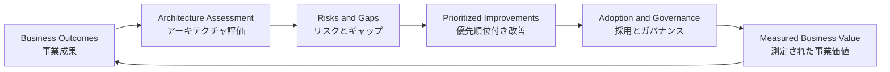

# Salesforce Well-Architected

## Executive Summary

Salesforce Well-Architectedは、Salesforce Customer 360 Platform上の
ソリューションが長期的に健全であるための判断軸、設計上の考慮事項、パターン、
アンチパターンを提供する公式フレームワークである。現行フレームワークは、
`Trusted`、`Easy`、`Adaptable`の3つの柱で構成される。

このフレームワークが重要なのは、アーキテクチャをコードや設定の品質だけでなく、
セキュリティ、信頼性、保守性、データ整合性、利用体験、運用、変更への対応力まで
含めて評価できるためである。柔軟性の高いSalesforceでは、技術的に実現可能な設計が
必ずしも事業価値、運用可能性、ユーザー定着を満たすとは限らない。

実務では、Salesforce Well-Architectedを一度限りの採点表として扱わない。
現状把握、リスク発見、優先順位付け、改善、効果測定を繰り返す共通言語として使う。
アーキテクチャレビューでは、各所見を事業影響、証拠、推奨アクション、担当者、
確認指標に結び付けることで、運用改善へつなげられる。

## 1. Purpose and Scope

### 1.1 想定読者

この章は、次の実務担当者を対象とする。

- Salesforceアーキテクト、コンサルタント、管理者。
- Sales CloudまたはService Cloudの業務責任者とプロダクトオーナー。
- セキュリティ、データ、連携、レポートを担当するIT関係者。
- グローバル組織の標準を守りながら、ローカル業務を改善する担当者。
- 限られた稼働時間で改善計画を作る外部または社内コンサルタント。

### 1.2 この章が支援する意思決定

- どのアーキテクチャ上のリスクを先に扱うか。
- 標準機能、設定、Flow、コード、外部サービスのどれを選ぶか。
- 技術的負債をいつ、どの事業影響と結び付けて解消するか。
- グローバル標準を維持しつつ、ローカル要件をどう実現するか。
- データ品質、利用定着、レポート、運用課題を設計課題としてどう扱うか。
- 最初の30日で何を確認し、何を成果物にするか。

### 1.3 対象と対象外

対象は、Salesforceソリューションの現状評価、設計判断、改善優先順位、運用体制、
ユーザー定着、成果測定である。製品固有の詳細設定手順、ライセンス比較、法的助言、
個別組織の監査証跡、特定業界の規制判断は対象外とする。

本章のチェックリストは、正式なセキュリティ監査、性能試験、法令適合性評価、
データ保護影響評価を代替しない。必要な専門家と公式資料を確認するための入口として
使用する。

## 2. Salesforce Official Guidance

**公式情報確認日:** 2026-07-20

Salesforce公式の
[Well-Architected Overview](https://architect.salesforce.com/docs/architect/well-architected/guide/overview.html)
は、健全なSalesforceソリューションを`Trusted`、`Easy`、`Adaptable`として整理する。
この3つは独立した採点項目ではなく、複雑なトレードオフを判断するときに戻る
中核的な判断軸である。

### 2.1 Trusted：事業とステークホルダーを保護する

[Trusted](https://architect.salesforce.com/docs/architect/well-architected/guide/trusted-overview.html)
は、`Secure`、`Compliant`、`Reliable`で構成される。

| 公式の構成要素 | 実務上の意味 | 主な確認対象 |
| --- | --- | --- |
| Secure | 承認された主体だけが必要な機能とデータへアクセスし、データを保護する | 認証、認可、セッション、共有、可視性、暗号化 |
| Compliant | 法令、業界基準、倫理方針、アクセシビリティ要件に従う | データプライバシー、ローカライゼーション、社内方針、AI、操作性 |
| Reliable | 想定される条件下で効率的かつ安定して動作する | 可用性、性能、拡張性、リスク管理、障害軽減、データ量 |

Trustedのレビューでは、データの種類、システム・オブ・レコード、利用者、接続システム、
事業上の重要度、リスク許容度を先に確認する。設定画面だけを見て安全性を判断せず、
事業、法務・コンプライアンス、セキュリティ、運用担当との合意を証拠に含める。

### 2.2 Easy：価値を速く届ける

[Easy](https://architect.salesforce.com/docs/architect/well-architected/guide/easy-overview.html)
は、`Intentional`、`Automated`、`Engaging`で構成される。

| 公式の構成要素 | 実務上の意味 | 主な確認対象 |
| --- | --- | --- |
| Intentional | 戦略的に計画され、保守しやすく、人が理解できる | 優先順位、ロードマップ、ガバナンス、標準対カスタム、技術的負債、文書化 |
| Automated | 反復作業を減らし、正しい処理を規模に応じて実行する | プロセス設計、業務ロジック、KPI、データ処理、エラー処理 |
| Engaging | 利用者にとって直感的で有用な体験を提供し、定着を促す | アプリ複雑性、フォーム、画面、通知、アプリ内ガイダンス |

Easyは「設定が簡単」という意味ではない。公式ガイダンスは、業務優先度、利用者の日常、
デリバリーおよび保守チームのスキルを理解したうえで、価値、保守性、自動化、利用体験の
トレードオフを判断することを求めている。

### 2.3 Adaptable：事業変化に合わせて進化する

[Adaptable](https://architect.salesforce.com/docs/architect/well-architected/guide/adaptable-overview.html)
は、`Resilient`、`Composable`で構成される。

| 公式の構成要素 | 実務上の意味 | 主な確認対象 |
| --- | --- | --- |
| Resilient | 変更や障害の後、予測可能な方法で期待状態へ戻れる | リリース、環境、テスト、監視、インシデント対応、事業継続 |
| Composable | 責務を分けた構成単位を安定して交換・拡張できる | 関心の分離、状態管理、API、イベント、疎結合、依存関係、パッケージ化 |

Adaptableのレビューでは、現在の要件だけでなく、事業の方向性、組織間の差異、
運用能力、将来変更を考える。人、プロセス、技術を同時に評価し、変更の影響範囲と
復旧可能性を明らかにする。

### 2.4 公式フレームワークの実務利用

Salesforceの
[Patterns Explorer](https://architect.salesforce.com/docs/architect/well-architected-tools/guide/patterns)
は、3つの柱を具体的なパターンへ展開している。また、`Intentional`の公式ガイダンスは、
優先順位、ロードマップ、ガバナンス、標準機能とカスタム機能、技術的負債、設計標準、
文書化を関連付けている。

公式フレームワークは、すべての組織へ同じ実装を強制するものではない。パターンと
アンチパターンを使って設計を検証し、事業文脈に応じたトレードオフを記録するための
指針である。

## 3. LeonDX Insight

> **LeonDX interpretation:** このセクションはSalesforce公式文書の引用ではなく、
> 実務適用のためのLeonDXによる解釈と推奨である。

### 3.1 経験ある運用者は「設定」より「結果と証拠」から見る

経験ある運用者は、最初にメタデータを網羅的に読むのではなく、事業成果、利用者の行動、
データ、運用記録、変更履歴から問題の兆候を探す。たとえば入力必須項目が設定されていても、
利用者が意味のない値を入れるなら、データ品質は確保されていない。共有設定が理論上正しくても、
サポートのたびに広い権限を付与しているなら、Trustedな運用とは言えない。

各所見は「何が設定されているか」だけでなく、次の5点で記録する。

1. 期待する事業結果。
2. 観察した事実と証拠。
3. 事業・セキュリティ・運用上の影響。
4. 推奨アクションと意思決定者。
5. 改善を確認する指標と確認日。

### 3.2 技術品質だけでは十分ではない

技術的に正しいソリューションでも、利用されない、データが信頼されない、KPI定義が違う、
変更の所有者がいない、問い合わせ対応が属人化している場合、事業価値を継続的に提供できない。
アーキテクチャ品質は、設定とコードに加えて、採用、ガバナンス、データ品質、レポート、
運用プロセスを含む社会技術的な品質として評価する。

### 3.3 採用、データ、レポート、運用を一つの因果関係で見る

低い利用率を研修だけで解決しようとしない。入力負荷、画面設計、重複作業、データの信頼性、
上司が利用するKPI、サポート応答、権限不足を一つの流れとして確認する。利用者が入力した
データが判断や支援に使われることを実感できなければ、定着しにくい。

改善仮説は、たとえば「入力項目削減 → 完了率向上 → データ欠損減少 → レポート信頼性向上」
のように、技術変更から測定可能な業務結果までつなげる。

### 3.4 グローバル組織とローカル事業部門を両立させる

グローバル組織で使われるSalesforceでは、グローバル標準を無条件に変更することも、
無条件に固定することも避ける。次の順序で判断する。

1. グローバル標準の目的、必須範囲、所有者、変更手続きを確認する。
2. ローカル業務の差異を、法令、言語、プロセス、KPI、連携、ユーザー体験に分解する。
3. 設定変更の前に、標準機能、権限、レコードタイプ、動的表示、Flow、レポート設定などの
   構成可能な選択肢を評価する。
4. 例外が必要なら、事業価値、影響範囲、依存関係、保守責任、廃止条件を意思決定記録に残す。
5. ローカル改善で得たパターンをグローバル所有者へ戻し、再利用可能性を評価する。

## 4. Architecture Decision Framework

次の表は、初期評価で使う実務向け意思決定フレームワークである。リスクシグナルは
結論ではなく、追加証拠を集めるきっかけとして扱う。

| Decision area | Key question | Risk signal | Recommended action | Evidence to collect |
| --- | --- | --- | --- | --- |
| Data | 重要な業務判断に必要なデータは、定義・所有・入力・更新されているか | 重複、空欄、自由入力の乱立、未使用項目、同じ指標の不一致 | 重要データ要素を絞り、所有者、品質ルール、修正順序を決める | 項目利用率、重複例、入力経路、データ辞書、レポート依存関係 |
| Security | 利用者とシステムは必要最小限のデータと機能だけにアクセスできるか | 広いプロファイル、恒久的な例外、共有理由が不明、退職者対応の遅れ | ペルソナとアクセス行列を作り、権限セット中心に例外を縮小する | ユーザー一覧、権限セット、共有設定、監査履歴、アクセス申請 |
| Automation | 自動化の目的、所有者、失敗時対応、重複が明確か | 同一オブジェクトに多数のFlow、無効化された自動化、通知の氾濫 | 業務成果ごとに自動化を棚卸しし、責務、順序、エラー処理を統合する | Flow一覧、エラー通知、実行失敗、処理時間、所有者、テスト結果 |
| Integration | システム間の責任、データ契約、障害時動作が明確か | 点対点接続、手作業再送、認証の属人化、重複データ移送 | システム・オブ・レコードとデータフローを明示し、監視と再処理を設計する | 連携図、API利用、インターフェース契約、障害記録、再送手順 |
| Reporting | KPI定義とレポートデータが意思決定に使えるか | 同名KPIの計算差、手元表計算への再出力、ダッシュボード未利用 | KPI定義、粒度、責任者、データ源、更新頻度を合意してから可視化する | KPI辞書、レポート利用状況、抽出手順、会議資料、データ欠損 |
| Governance | 誰が何を決め、優先し、変更し、支援するか明確か | FIFOバックログ、緊急変更の常態化、承認経路不明、文書不在 | 意思決定権、受付、優先順位、リリース、例外管理を最小限で定義する | RACI、バックログ、変更履歴、リリース予定、設計記録、SLA |
| User adoption | 利用者はSalesforceで重要業務を完了し、価値を得ているか | ログインだけを採用指標にする、二重入力、回避手順、研修依存 | ペルソナ別の重要タスクを観察し、摩擦と価値を測定して改善する | 利用ログ、タスク観察、インタビュー、入力時間、サポート件数 |
| Support and operations | 問題を検知、切り分け、復旧し、再発防止できるか | 一人の管理者に集中、監視不足、口頭手順、同じ障害の反復 | サービス所有、一次対応、エスカレーション、監視、運用手順を定義する | 問い合わせ履歴、インシデント、運用手順、担当表、復旧時間 |

## 5. Assessment Method

以下は、コンサルティング開始後の最初の30日に適した軽量レビュー法である。
公式認定手法ではなく、Salesforce Well-Architectedを短期間で運用改善へ結び付ける
LeonDX推奨プロセスである。

### Phase 1: Understand

**目的:** 事業成果、利用者、システム境界、意思決定構造を理解する。

**主な活動:**

- スポンサー、業務責任者、利用者、管理者、グローバル所有者へ聞き取りを行う。
- 重要な業務プロセス、KPI、ピーク時期、困りごと、変更制約を整理する。
- システムコンテキスト、主要データ、連携、利用者ペルソナを概略化する。
- 既存バックログ、運用手順、設計資料、レポートを収集する。

**期待する成果物:** 成果仮説、ステークホルダーマップ、対象範囲、システム概略図、
初期確認事項一覧。

**よくある誤り:** 管理者だけに聞く、要望一覧を成果と混同する、画面や設定を先に直す、
グローバルとローカルの責任境界を確認しない。

### Phase 2: Assess

**目的:** `Trusted`、`Easy`、`Adaptable`の観点から、事実に基づく所見を作る。

**主な活動:**

- 権限、共有、データ、Flow、連携、レポート、変更・支援プロセスをサンプリングする。
- 利用者の主要タスクを観察し、二重入力、待ち時間、回避手順を確認する。
- データ欠損、重複、項目利用、レポート整合性を重要業務データに絞って調べる。
- 所見ごとに証拠、影響、確信度、追加確認を記録する。

**期待する成果物:** 現状評価、リスク・ギャップ一覧、証拠台帳、未確認事項、
簡易ヒートマップ。

**よくある誤り:** 全メタデータを均等に調べる、設定数だけで健全性を判断する、
単一の証言を事実と扱う、法務やセキュリティ判断を推測する。

### Phase 3: Prioritize

**目的:** 限られた能力を、事業価値とリスクが高い改善へ配分する。

**主な活動:**

- 各所見を事業影響、リスク、緊急性、依存関係、労力で比較する。
- クイックウィン、前提作業、中期改善、経営判断が必要な項目に分ける。
- 技術的負債を、売上や顧客情報などの機密値を使わず、処理時間、品質、リスク、
  保守性と結び付ける。
- 意思決定者、所有者、完了条件、測定指標を合意する。

**期待する成果物:** 優先順位付きバックログ、依存関係、推奨順序、意思決定事項、
30・60・90日ロードマップ。

**よくある誤り:** 先着順で処理する、作りやすさだけで選ぶ、所有者なしで登録する、
すべてを最高優先度にする。

### Phase 4: Improve

**目的:** 小さく安全な改善を実装し、運用可能な形で引き渡す。

**主な活動:**

- 実装前の基準値、受入条件、ロールバック、テスト、リリース方法を決める。
- 低リスクの改善を小さな単位で実施する。
- 設定だけでなく、手順、所有者、文書、利用者への案内を更新する。
- グローバル標準への影響と例外承認を記録する。

**期待する成果物:** 検証済み変更、意思決定記録、更新文書、利用者向け案内、
運用引継ぎ。

**よくある誤り:** 本番で直接変更する、複数仮説を同時に変える、技術完了を成果とする、
支援チームへ知らせない。

### Phase 5: Measure

**目的:** 改善が利用者、データ、運用、事業判断へ与えた効果を確認する。

**主な活動:**

- 事前に決めた指標を変更前後で比較する。
- 利用者と運用担当から定量・定性フィードバックを得る。
- 副作用、未解決リスク、新しい依存関係を確認する。
- 継続、修正、撤回、横展開の判断を記録する。

**期待する成果物:** 効果測定、残存リスク、次の優先順位、再利用可能なパターン、
レビュー日。

**よくある誤り:** ログイン数だけで定着を判断する、基準値を取らない、短期結果だけを見る、
改善しなかった結果を隠す。

## 6. Practical Review Checklist

チェック結果には、`Yes / No`だけでなく、証拠、所有者、次回確認日を添える。

### Architecture

- [ ] 事業成果、対象範囲、主要ペルソナが説明できる。
- [ ] システムコンテキストと主要なデータフローが最新である。
- [ ] 重要な設計判断に、選択肢、理由、トレードオフが記録されている。
- [ ] 標準機能、AppExchange、ローコード、コードの選択基準がある。
- [ ] 技術的負債が事業影響とともにバックログ化されている。

### Data quality

- [ ] 重要データ要素とその業務所有者が定義されている。
- [ ] 必須性、妥当性、重複、鮮度、完全性の基準が合意されている。
- [ ] 大量の未使用項目や同義項目が把握されている。
- [ ] データ修正が入力プロセスと再発防止策に結び付いている。
- [ ] レポートと連携が参照する項目の変更影響を追跡できる。

### Security and access

- [ ] 利用者ペルソナと必要アクセスの行列がある。
- [ ] 権限セットと権限セットグループの割当方針が明確である。
- [ ] 共有設定と例外ルールに業務上の理由と所有者がある。
- [ ] 参加、異動、退職に伴うアクセス変更が定期的に確認される。
- [ ] 高権限アクセスと連携ユーザーが監視・レビューされている。

### Automation

- [ ] 各自動化に業務目的、所有者、起動条件、依存関係がある。
- [ ] 同一オブジェクト上のFlowやコードの実行関係が理解されている。
- [ ] エラー処理、通知、再処理、監視方法が定義されている。
- [ ] 正常系、例外系、一括処理、権限差のテストがある。
- [ ] 自動化の効果を確認するKPIがある。

### Integration

- [ ] システム・オブ・レコードとデータ所有権が明確である。
- [ ] インターフェース契約、認証、データ分類が文書化されている。
- [ ] タイムアウト、重複、順序、部分失敗、再送を考慮している。
- [ ] 監視、アラート、一次対応、エスカレーションが定義されている。
- [ ] API利用量、遅延、失敗傾向を確認できる。

### Reports and dashboards

- [ ] KPIの名称、定義、粒度、期間、所有者が合意されている。
- [ ] ダッシュボードの数値を元データまで追跡できる。
- [ ] 閲覧対象者と意思決定の用途が明確である。
- [ ] 重複・未使用・手動補正されるレポートを把握している。
- [ ] データ品質上の制約を利用者へ明示している。

### Governance

- [ ] 受付、評価、優先順位、承認、リリースの流れが明確である。
- [ ] 事業、ローカル、グローバル、ITの意思決定権が区別されている。
- [ ] 緊急変更と標準変更に、それぞれ安全な経路がある。
- [ ] 設計標準と例外記録を検索できる。
- [ ] バックログが定期的に整理され、完了条件を持つ。

### Adoption and training

- [ ] ペルソナ別の重要タスクと期待する利用行動が定義されている。
- [ ] 利用者がSalesforce外で行う回避作業を把握している。
- [ ] 研修以外の摩擦要因を、画面、権限、データ、プロセスから確認している。
- [ ] 利用状況をログイン数以外の成果指標でも測定している。
- [ ] 利用者フィードバックが改善バックログへつながる。

### Operational support

- [ ] サービス所有者、管理者、一次対応、開発担当の責任が明確である。
- [ ] 問い合わせ分類、優先度、SLA、エスカレーションが定義されている。
- [ ] 重要な定期処理、連携、Flow失敗を監視している。
- [ ] 頻出問題の対応手順と既知エラーを検索できる。
- [ ] インシデント後に原因、再発防止、所有者を記録している。

## 7. Common Anti-Patterns

| Anti-pattern | Symptom | Underlying cause | Risk | Corrective action |
| --- | --- | --- | --- | --- |
| 採用問題を研修だけで解決する | 研修後も二重入力、回避手順、入力遅延が続く | 画面、権限、プロセス、データ価値を確認していない | 利用者の疲弊、データ欠損、投資効果低下 | 重要タスクを観察し、摩擦要因と利用者が得る価値を改善する |
| カスタム項目を過剰に作る | 同義項目、空欄、未使用項目、画面の長大化が増える | 要件ごとに既存モデルや利用目的を確認せず項目追加する | データ不整合、保守負荷、レポート混乱 | 重要データ要素、利用先、所有者を確認し、統合・廃止基準を設ける |
| 所有者なしで自動化する | Flow失敗が放置され、誰も変更影響を説明できない | 実装完了を優先し、運用・監視・責任を設計していない | 障害長期化、誤更新、変更リスク | 業務所有者と技術所有者、監視、エラー処理、テストを登録する |
| グローバルテンプレートを不可侵と扱う | ローカル業務が手作業や外部表計算へ流出する | 標準の目的と例外手続きが不透明 | 低採用、シャドーIT、データ断絶 | 標準の意図を確認し、構成可能な差異と正式な例外判断を分ける |
| 事業影響を測らず設定を変える | 多数の改善が完了しても成果を説明できない | 基準値、仮説、受入条件、確認指標がない | 無効な変更の蓄積、優先順位への不信 | 変更前に期待結果と指標を定義し、変更後に継続・撤回を判断する |
| KPI定義より先にダッシュボードを作る | 会議ごとに数値の正しさを議論する | 名称、計算、粒度、期間、所有者が未合意 | 誤った意思決定、レポート乱立 | KPI辞書と意思決定用途を合意してからレポートを設計する |
| 支援問題を広いアクセス付与で解決する | 例外権限が恒久化し、誰が何を見られるか不明になる | 原因分析より即時復旧を優先し、期限と承認を記録しない | 不要アクセス、情報漏えい、監査困難 | 一時付与の期限、承認、原因、恒久対策を記録し、最小権限へ戻す |
| 一人の管理者の未文書知識に依存する | 休暇や退職で変更・障害対応が止まる | 文書化、相互レビュー、権限分離、引継ぎを後回しにする | 単一障害点、復旧遅延、誤変更 | 運用手順、設計記録、レビュー、代替担当、アクセス管理を整備する |

## 8. First-Month Questions

以下の質問は、特定の顧客や業界に依存しない再利用可能な聞き取り項目である。
回答は事実、意見、仮説を区別して記録する。

### Business leaders

1. Salesforceを通じて改善したい事業成果は何ですか。
2. 今後3〜12か月で変わる可能性が高い業務や優先事項は何ですか。
3. 現在の意思決定で、信頼できるデータが不足している場面はどこですか。
4. どの業務停止やデータ問題が最も大きなリスクになりますか。
5. Salesforce改善の優先順位を誰が、どの基準で決定しますか。
6. 30日後にどの変化が見えれば、レビューが有益だったと判断できますか。

### Sales users

1. 毎日または毎週、Salesforceで完了すべき重要タスクは何ですか。
2. Salesforce外の表計算、メール、メモへ同じ情報を入力する場面はありますか。
3. 入力に時間がかかる、意味が分からない、不要だと感じる項目はありますか。
4. 次のアクションを決めるために不足している情報は何ですか。
5. Salesforceのデータやレポートを信頼できないと感じる例はありますか。
6. 問題が起きたとき、どこへ連絡し、解決まで何が起きますか。

### Salesforce administrators

1. 現在の変更受付、設計、テスト、承認、リリースの流れを説明できますか。
2. 最も頻繁な問い合わせと、繰り返し発生する原因は何ですか。
3. 失敗を監視しているFlow、連携、定期処理はどれですか。
4. 技術的負債と未使用設定をどのように把握し、優先順位付けしていますか。
5. 高権限、共有例外、連携ユーザーをどの頻度で見直していますか。
6. 自分が不在でも安全に運用できる文書と代替担当がありますか。

### Global platform owners

1. グローバル標準が守ろうとしている事業・データ・セキュリティ上の目的は何ですか。
2. ローカル構成で許容される範囲と、例外承認が必要な範囲はどこですか。
3. 変更提案、設計レビュー、リリース調整の正式な経路は何ですか。
4. グローバルとローカルで、データ、設定、支援の所有権をどう分けていますか。
5. 共通KPIとローカルKPIの定義・変更は誰が管理しますか。
6. ローカルで有効だった改善をグローバルへ還元する方法はありますか。

### Reporting stakeholders

1. 各ダッシュボードは、どの意思決定と会議を支援していますか。
2. 重要KPIの名称、計算、粒度、期間、所有者は文書化されていますか。
3. レポート数値を元レコードと入力プロセスまで追跡できますか。
4. Salesforceから表計算へ出力した後、どのような手動補正をしていますか。
5. 欠損、重複、遅延が判断に与える影響は何ですか。
6. 閲覧されないレポートや、同じ目的の重複レポートはありますか。

### Integration or IT teams

1. 各主要データのシステム・オブ・レコードはどれですか。
2. 接続ごとの所有者、認証方式、実行頻度、データ分類は明確ですか。
3. 部分失敗、重複、順序逆転、再送をどのように処理しますか。
4. 障害を誰が検知し、どのログで切り分け、誰へ連絡しますか。
5. API利用量、遅延、失敗率、再処理件数の傾向を確認できますか。
6. 今後のシステム変更で、Salesforce連携へ影響する予定はありますか。

## 9. Deliverables for a 20% Engagement

週1日程度の稼働では、広範な実装より、焦点を絞った評価、合意形成、優先順位付け、
小さな改善が現実的である。会議、調査、文書化、実装、検証のすべてが同じ限られた能力を
消費するため、同時進行項目を制限する。

### 9.1 現実的な成果物

| Deliverable | 現実的な範囲 | 完了の目安 |
| --- | --- | --- |
| Current-state assessment | 重要な1〜2業務プロセスと関連するSalesforce領域を評価する | 事実、影響、証拠、未確認事項が整理されている |
| Prioritized backlog | リスク、価値、労力、依存関係で上位項目を整理する | 所有者、次の判断、完了条件がある |
| Data quality findings | 重要項目に絞って欠損、重複、定義、利用先を確認する | 修正優先度と再発防止仮説がある |
| Adoption findings | 少数の代表利用者と重要タスクを観察する | 摩擦、回避行動、価値仮説、測定方法がある |
| KPI and dashboard recommendations | 重要KPIの定義と意思決定用途を整理する | 新規構築前の合意事項と改善案がある |
| Governance recommendations | 受付、優先順位、変更、例外、支援の最小運用を提案する | 意思決定者と軽量な運用リズムが明確である |
| Quick wins | 低リスク・小規模で測定可能な改善を1件ずつ扱う | テスト、承認、文書、効果確認が完了している |
| Medium-term roadmap | 依存関係を含む30・60・90日以降の方向を示す | 実施順序、意思決定、必要能力が見える |

### 9.2 限られた能力では非現実的な期待

- 30日でSalesforce org全体を完全監査すること。
- 多数の業務部門、連携、レポートを同じ深さで評価すること。
- 大規模なデータクレンジング、再設計、移行を一人で完了すること。
- グローバルガバナンスやKPI定義を、関係者の合意なしに変更すること。
- 評価、設計、実装、テスト、研修、運用引継ぎを多数案件で並行すること。
- ログイン数だけで短期間に採用効果を証明すること。

**Recommendation:** 最初の1か月は、重要な業務結果に直結する範囲を一つ選び、
「理解 → 評価 → 優先順位」の品質を高める。実装は、リスクが低く測定可能な
クイックウィンに限定する。

## 10. Mermaid Diagram

次の図は、事業成果から測定可能な価値までをつなぐ継続的な改善フローを示す。

このフローでは、改善の完了を設定変更ではなく、採用とガバナンスを通じて確認された
事業価値で判断する。測定結果は次の評価と優先順位へ戻す。

## 11. FAQ

### Q1. Salesforce Well-Architectedとは何ですか

Salesforce Customer 360 Platform上で健全なソリューションを設計・評価するための
公式フレームワークである。`Trusted`、`Easy`、`Adaptable`の3つの柱と、具体的な
考慮事項、パターン、アンチパターンを提供する。

### Q2. Salesforce Well-Architectedはチェックリストですか

チェックリストとして利用できる部分はあるが、本質はトレードオフを判断するための
思考フレームワークである。点数だけで終えず、証拠、事業影響、優先順位、改善指標へ
つなげる。

### Q3. 現行の3つの柱は何ですか

`Trusted`、`Easy`、`Adaptable`である。古いブログや別クラウドのWell-Architectedに
ある異なる柱名を混用せず、Salesforce公式の現行Overviewを確認する。

### Q4. Trustedでは何を確認しますか

セキュリティだけでなく、法令・倫理・アクセシビリティへの適合、可用性、性能、
拡張性も確認する。利用者、データ、リスク許容度、事業上の重要度を前提に評価する。

### Q5. Easyは管理者向けの簡単な設定という意味ですか

違う。Easyは、意図的に価値を届け、健全に自動化し、利用者が価値を感じて使える
ソリューションを指す。管理・保守チームが理解し所有できることも重要である。

### Q6. Adaptableと技術的な柔軟性は同じですか

完全には同じではない。Adaptableは、変更や障害から予測可能に戻れるResilientと、
責務を分けた単位を安定して変更できるComposableを含み、運用や事業継続も対象とする。

### Q7. 利用率が低い場合、研修を増やせばよいですか

研修だけで判断しない。入力負荷、二重作業、権限、画面、データの信頼性、KPIとの接続、
サポートを確認する。重要タスクの摩擦と利用者が得る価値を先に特定する。

### Q8. 最初の30日でorg全体を評価できますか

完全評価は現実的ではない。重要な事業成果と1〜2の主要プロセスに範囲を絞り、
高リスクの横断領域をサンプリングし、未確認事項を明示する方が有用である。

### Q9. グローバル標準とローカル要件が衝突したらどうしますか

標準の目的、必須範囲、所有者、例外手続きを確認する。ローカル差異を分解し、
構成可能な選択肢を評価した後、必要な例外の価値、影響、保守責任、廃止条件を記録する。

### Q10. アーキテクチャ改善の優先順位はどう決めますか

事業影響、セキュリティ・運用リスク、緊急性、依存関係、実施労力、測定可能性を比較する。
作りやすさや依頼順だけで決めず、前提作業と意思決定事項を分ける。

### Q11. ダッシュボード改善はどこから始めますか

画面作成ではなく、KPIの名称、目的、計算、粒度、期間、所有者、データ源の合意から始める。
その後、元データの品質と意思決定での利用方法を確認する。

### Q12. Well-Architectedレビューの成果物は何ですか

現状評価、証拠付きリスク・ギャップ、優先順位付きバックログ、意思決定事項、
クイックウィン、ロードマップ、測定方法が代表例である。成果物は対象範囲と能力に合わせる。

### Q13. 技術的負債はどのように説明しますか

古い技術という表現だけでなく、変更時間、障害リスク、データ品質、利用者への影響、
運用コストなど、行動する場合としない場合の事業影響へ結び付ける。

### Q14. レビュー結果が正しいかどうかはどう確認しますか

設定、利用ログ、データ、運用記録、インタビューなど複数の証拠を照合する。事実、意見、
仮説、未確認事項を区別し、対象領域の所有者とレビューする。

## 12. Certification and Learning Points

この節は試験問題や出題内容を再現するものではない。Well-Architectedの観点を、
各ロールで必要になる学習と実務判断へ関連付けたものである。

### Salesforce Administrator

- 認証、権限、共有、データ品質、Flow、レポート、監査、変更管理を個別機能ではなく
  運用システムとして理解する。
- 権限付与や必須項目が、利用者体験と業務結果へ与える影響を説明する。
- 管理作業、例外、定期レビュー、支援手順を文書化する。

### Sales Cloud Consultant

- 営業プロセス、データモデル、採用、KPI、予測・レポートの因果関係を整理する。
- 標準機能とカスタム要件のトレードオフを、保守性と事業価値で説明する。
- 利用者の重要タスクを観察し、入力品質と意思決定への利用を評価する。

### Service Cloud Consultant

- ケース受付、ルーティング、自動化、ナレッジ、オムニチャネル、支援運用を、
  信頼性と利用体験の両面から考える。
- 障害、エスカレーション、サービス所有、監視、継続性を設計に含める。
- KPI定義と元データ品質を確認してからダッシュボードを評価する。

### Platform App Builder

- データモデル、画面、権限、Flow、レポートを、一貫した設計意図で構成する。
- 標準機能を優先し、カスタム化の理由、依存関係、テスト、保守方法を記録する。
- 自動化を効率だけでなく、データ整合性、エラー処理、所有権で評価する。

### Salesforce architect learning

- `Trusted`、`Easy`、`Adaptable`を、設計トレードオフの共通言語として使う。
- システム境界、データ所有、連携契約、セキュリティ、ALM、運用継続性を横断して考える。
- 技術判断を、事業成果、組織能力、採用、ガバナンス、測定へつなげる。
- パターンを盲目的に適用せず、文脈、選択肢、影響、決定理由を残す。

公式の自己学習には、Salesforce Architectsの
[Salesforce Well-Architected Overview](https://architect.salesforce.com/docs/architect/well-architected/guide/overview.html)
を起点として、各領域のガイダンスとパターンを確認できる。

## 13. RAG Keywords

### English keywords

Salesforce Well-Architected, Trusted, Easy, Adaptable, Secure, Compliant,
Reliable, Intentional, Automated, Engaging, Resilient, Composable,
architecture assessment, architecture review, data quality, user adoption,
Salesforce governance, technical debt, operating model, global org,
local business unit, security review, Flow governance, KPI definition,
dashboard governance, integration monitoring, support model, 30-day assessment,
prioritized backlog, architecture decision record.

### 日本語キーワード

Salesforceアーキテクチャ、Well-Architected、アーキテクチャ評価、現状分析、
信頼性、セキュリティ、権限、共有、データ品質、利用定着、ユーザー採用、
ガバナンス、技術的負債、自動化、Flow管理、連携監視、KPI定義、
ダッシュボード、運用支援、グローバル組織、ローカル要件、優先順位、
30日評価、クイックウィン、改善ロードマップ。

### Common synonyms

- Well-Architected Framework / Salesforce architecture framework / 健全性評価。
- Architecture assessment / health check / current-state assessment / 現状診断。
- User adoption / user engagement / 利用定着 / 活用促進。
- Governance / operating model / decision rights / 運用統制 / 意思決定体制。
- Technical debt / legacy configuration / maintenance burden / 技術的負債。
- Data quality / data integrity / completeness / accuracy / データ健全性。
- Global template / global standard / core model / グローバル標準。

### Likely user questions

- Salesforce Well-Architectedの3つの柱は何ですか。
- Salesforce orgの健全性を最初の30日でどう評価しますか。
- Trusted、Easy、Adaptableの違いは何ですか。
- Salesforceの利用率が低い原因をどう調べますか。
- データ品質とユーザー採用はどう関係しますか。
- Flowが多すぎるorgをどう評価しますか。
- グローバル標準とローカル要件をどう両立しますか。
- Salesforceガバナンスで最初に決めることは何ですか。
- KPI定義とダッシュボードのどちらを先に作りますか。
- 週1日のコンサルティングで何を成果物にできますか。
- Salesforceアーキテクチャレビューのチェックリストはありますか。
- 技術的負債を事業部門へどう説明しますか。

## 14. References

以下は、本章の公式ガイダンス、柱、構成要素、パターン、学習ポイントの確認に
実際に使用したSalesforce公式資料である。アクセス日はすべて2026-07-20。

1. **Salesforce Well-Architected Overview**
   - Publisher: Salesforce Architects
   - URL: <https://architect.salesforce.com/docs/architect/well-architected/guide/overview.html>
   - Accessed: 2026-07-20
2. **Trusted | Salesforce Well-Architected**
   - Publisher: Salesforce Architects
   - URL: <https://architect.salesforce.com/docs/architect/well-architected/guide/trusted-overview.html>
   - Accessed: 2026-07-20
3. **Easy | Salesforce Well-Architected**
   - Publisher: Salesforce Architects
   - URL: <https://architect.salesforce.com/docs/architect/well-architected/guide/easy-overview.html>
   - Accessed: 2026-07-20
4. **Adaptable | Salesforce Well-Architected**
   - Publisher: Salesforce Architects
   - URL: <https://architect.salesforce.com/docs/architect/well-architected/guide/adaptable-overview.html>
   - Accessed: 2026-07-20
5. **Intentional | Easy | Salesforce Well-Architected**
   - Publisher: Salesforce Architects
   - URL: <https://architect.salesforce.com/docs/architect/well-architected/guide/intentional.html>
   - Accessed: 2026-07-20
6. **Patterns Explorer | Well-Architected Tools**
   - Publisher: Salesforce Architects
   - URL: <https://architect.salesforce.com/docs/architect/well-architected-tools/guide/patterns>
   - Accessed: 2026-07-20
