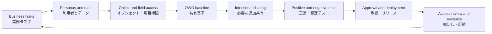

# Salesforce Security and Sharing

## Executive Summary

Salesforceのセキュリティと共有は、利用者が「どの組織へログインできるか」、
「どの機能を実行できるか」、「どのオブジェクトと項目を扱えるか」、
「どのレコードへアクセスできるか」を複数の層で制御する仕組みである。
安全な設計には、認証、認可、オブジェクト権限、項目権限、レコード共有を
一つのアクセスモデルとして扱う必要がある。

レコードアクセスは、組織の共有設定（Organization-Wide Defaults、OWD）を
基準に、ロール階層、共有ルール、チーム、テリトリー、手動共有などで必要な
アクセスを追加する。共有はオブジェクト権限や項目レベルセキュリティを
置き換えない。利用者がレコードを共有されても、そのオブジェクトを読む権限や
対象項目を見る権限がなければ、必要な操作はできない。

実務では、設定の一覧だけで安全性を判断しない。アクセス要件、実際の付与経路、
利用者の業務、データ機密度、外部ユーザー、連携ユーザー、期限付きアクセス、
変更と棚卸しの運用を証拠で確認する。優れた共有設計は、最小権限を保ちながら、
利用者が重要な業務を完了でき、管理者がアクセス理由を説明できる設計である。

## 1. Purpose and Scope

### 1.1 想定読者

この章は、次の実務担当者を対象とする。

- Salesforce管理者、アーキテクト、コンサルタント、開発者。
- Sales CloudまたはService Cloudの業務責任者。
- Identity and Access Management（IAM）、セキュリティ、監査の担当者。
- Experience Cloud、連携、データ、レポートの担当者。
- グローバル標準とローカル業務要件を調整するプラットフォーム担当者。

### 1.2 この章が支援する意思決定

- 利用者へ必要十分な権限をどの単位で付与するか。
- プロファイル、権限セット、権限セットグループをどう使い分けるか。
- オブジェクトごとのOWDをどの基準で決めるか。
- ロール階層、共有ルール、チーム、手動共有のどれを選ぶか。
- 機密項目と機密レコードをどの層で保護するか。
- 外部ユーザーと連携ユーザーのアクセスをどう分離するか。
- 一時的アクセスをどう付与し、期限後に確実に回収するか。
- アクセス障害と過剰アクセスをどの証拠で調査するか。

### 1.3 対象範囲

対象は、組織アクセス、オブジェクト権限、項目レベルセキュリティ、
レコードレベルアクセス、OWD、ロール階層、共有ルール、手動共有、
Restriction Rules、外部ユーザーアクセス、アクセス調査、運用ガバナンスである。

認証については、共有設計との境界を理解するために扱う。暗号鍵管理、詳細な
OAuth設計、ネットワークセキュリティ、法令解釈、個別製品ライセンス比較、
正式な侵入試験や監査意見は対象外とする。

**Caution:** 本章は設計レビューの実務ガイドであり、法務判断、コンプライアンス認証、
正式なセキュリティ監査を代替しない。組織の方針、契約、適用法令、ライセンス、
現行リリースの機能可用性を専門担当者と確認する。

## 2. Salesforce Official Guidance

**公式情報確認日:** 2026-07-23

### 2.1 Salesforceのアクセス制御は複数の層で構成される

Salesforce公式の
[Data Security](https://trailhead.salesforce.com/content/learn/modules/data_security)
は、アクセス制御を組織、オブジェクト、項目、レコードの層で説明している。
各層は異なる質問に答える。

| 制御層 | 答える質問 | 主な仕組み |
| --- | --- | --- |
| 組織 | 誰が、いつ、どこからログインできるか | ユーザー、認証、ログイン時間、IP範囲、セッション設定 |
| 機能 | どの機能や管理操作を実行できるか | ユーザー権限、カスタム権限、アプリ権限 |
| オブジェクト | どの種類のレコードを作成、参照、更新、削除できるか | オブジェクト権限 |
| 項目 | どの項目を参照または更新できるか | 項目レベルセキュリティ |
| レコード | 対象オブジェクトのどのレコードへアクセスできるか | OWD、ロール階層、共有ルール、その他の共有 |

認証は主体を確認し、認可はその主体が実行できる操作を決める。レコード共有は
認可の一部だが、オブジェクト権限や項目権限とは別の層である。画面に項目を
表示しないことは、項目レベルセキュリティの代わりにならない。

### 2.2 プロファイルは基本設定、権限セットは権限付与に使う

[Permissions and Access Settings](https://help.salesforce.com/s/articleView?id=permissions_about_users_access.htm&language=en_US)
によると、各ユーザーには1つのプロファイルが割り当てられ、複数の権限セットを
追加できる。Salesforceは、既定アプリ、既定レコードタイプ、ページレイアウト、
ログイン時間、ログインIP範囲などの基本設定にはプロファイルを使い、
オブジェクト、項目、ユーザー、タブなどの権限には権限セットを推奨している。

[Guidelines for Creating Permission Sets and Permission Set Groups](https://help.salesforce.com/s/articleView?id=platform.perm_sets_best_practices.htm&language=en_US&type=5)
は、可能な場合にMinimum Access - Salesforceプロファイルを基礎とし、業務上の
有限なタスクごとに小さく再利用可能な権限セットを作ることを推奨している。
権限セットグループは、ペルソナが必要とする複数の権限セットをまとめる。

権限は基本的に加算される。プロファイル、権限セット、権限セットグループの
いずれかが権限を付与していれば、別の付与元を外すだけでは権限を回収できない。
権限セットグループ内の一部権限を抑制する場合は、ミューティング権限セットを
検討する。期限が決まった作業には、利用可能な場合、権限セットまたは
権限セットグループ割り当ての有効期限を使用する。

### 2.3 オブジェクト権限と項目権限は操作可能範囲を決める

オブジェクト権限は、対象オブジェクトに対する作成、参照、更新、削除の
基本操作を制御する。`View All Records`や`Modify All Records`などの強い権限は、
対象オブジェクトのレコードアクセスを広げるため、通常のCRUD権限と分けて
リスクを評価する。

[Control Access to Fields](https://trailhead.salesforce.com/content/learn/modules/data_security/data_security_fields)
によると、項目権限はアプリ内の詳細画面だけでなく、関連リスト、リストビュー、
レポート、検索結果などにも適用される。ページレイアウトから項目を外すだけでは、
その項目へのアクセスをセキュリティ上制限したことにならない。

**Recommendation:** 機密項目は、画面構成ではなく項目レベルセキュリティで保護し、
必要に応じて暗号化、監査、データ分類などの追加制御を評価する。

### 2.4 OWDは他人が所有するレコードへの基準アクセスを決める

[Control Access to Records](https://trailhead.salesforce.com/content/learn/modules/data_security/data_security_records)
は、OWDを、ユーザーが所有していないレコードへの基準アクセスとして説明する。
オブジェクトごとに最も制限される利用者を想定し、その利用者が見てはいけない
レコードまたは編集してはいけないレコードが存在するかを判断する。

OWDは、オブジェクト権限を超える操作を付与しない。たとえば、共有によって
レコードアクセスを得ても、対象オブジェクトのEdit権限がなければ編集できない。
内部アクセスと外部アクセスは別々に評価する。

OWD変更では共有再計算が発生する。データ量、所有者の偏り、階層、共有ルールの
複雑性によっては処理時間と運用影響が大きくなるため、変更前に影響、実施時間、
監視方法、ロールバック判断を計画する。

### 2.5 ロール階層は組織図ではなくデータアクセス階層である

Salesforce Developersの
[Platform Sharing Architecture](https://developer.salesforce.com/docs/atlas.en-us.dat.meta/dat_intro.htm)
によると、ロール階層は、上位ロールの利用者が下位ロールの利用者が
アクセスできるレコードへアクセスする仕組みである。ロールは職位や人事上の
報告関係をそのまま複製するものではなく、必要なデータアクセスのまとまりを表す。

同じロールにいる利用者同士が、互いのレコードへ自動的にアクセスできるとは
限らない。横断チームやマトリクス組織のアクセスをロール階層へ無理に埋め込むと、
意図しない上位アクセスや保守困難な階層が生じる。横断アクセスには共有ルール、
チーム、テリトリーなど、要件に合う別の仕組みを評価する。

### 2.6 共有ルールはOWDより広いアクセスを自動付与する

[Sharing Rule Types](https://help.salesforce.com/s/articleView?id=platform.security_sharing_rule_types.htm&language=en_US&type=5)
は、所有者ベースと条件ベースの共有ルールを説明している。共有ルールは、
「どのレコードを」「誰へ」「どのアクセスレベルで」共有するかを定義する。

[Define Sharing Rules](https://trailhead.salesforce.com/content/learn/modules/data_security/data_security_sharing_rules)
によると、共有ルールはOWDより厳しいアクセスへ制限するものではなく、
予測可能な利用者グループへアクセスを追加する場合に適している。公開グループは、
複数のユーザー、ロール、テリトリー、他の公開グループを再利用可能な単位として
まとめる。

| 要件 | 適した候補 | 判断理由 |
| --- | --- | --- |
| 特定部門が所有する全レコードを別部門へ共有する | 所有者ベース共有ルール | 所有者グループと共有先を事前に特定できる |
| 特定条件に一致するレコードを担当部門へ共有する | 条件ベース共有ルール | 安定したレコード条件で自動判定できる |
| レコードごとに異なる協働メンバーへ共有する | チームまたは手動・プログラム共有 | 共有先がレコードごとに変わる |
| 上司が部下のレコードを参照する | ロール階層 | 管理アクセスを階層で表現できる |
| 外部ユーザーへ関連アカウントのデータを共有する | 共有セットまたは共有グループ | 外部ユーザー向けの関連性を利用できる |

### 2.7 手動共有は例外処理であり、所有権変更を考慮する

手動共有は、レコード所有者または十分な権限を持つ利用者が、個別レコードへの
アクセスを付与する仕組みである。予測できない一時的な共同作業には有用だが、
大規模な恒常アクセスの設計には適さない。

手動共有を使う場合は、誰が共有できるか、付与理由、レビュー方法、所有者変更時の
挙動を確認する。手動共有に依存した業務は、所有者変更や担当者異動後にアクセスが
変わる可能性があるため、恒常要件は自動化された共有方式へ移す。

### 2.8 Restriction Rulesは付与済みレコードを追加で絞り込む

[Create a Restriction Rule](https://help.salesforce.com/s/articleView?id=platform.security_restriction_rule_create.htm&language=en_US&type=5)
によると、Restriction Ruleがユーザーへ適用されると、OWD、共有ルール、
その他の共有でアクセス可能になったレコードが、指定したレコード条件で
さらにフィルタリングされる。

Restriction Rulesは、共有ルールの代わりにアクセスを付与する機能ではない。
利用可能なオブジェクト、エディション、ルール数、ユーザー体験には制約があるため、
現行の公式考慮事項を確認する。また、同じユーザーへ複数のアクティブなルールが
該当する設計は、期待どおりの制限になるかを必ず検証する。

### 2.9 外部ユーザーは内部ユーザーとは別の境界で設計する

[External User Access Best Practices](https://help.salesforce.com/s/articleView?id=platform.networks_access_best_practices.htm&language=en_US&type=5)
は、外部ユーザーの権限を最小限にし、可能な限り外部OWDをPrivateにすることを
推奨している。外部ユーザーのライセンス、アカウントとの関係、ロール、
公開グループ、共有先を内部ユーザーと分けて確認する。

外部ユーザーが関連するレコードへアクセスする要件では、可能な場合、
共有セットと共有グループを優先して評価する。外部ユーザーを含む公開グループは
入れ子にできるため、共有ルールから意図しない外部アクセスが生じないかを確認する。
ゲストユーザーへの共有は匿名アクセスであるため、通常の認証済み外部ユーザーより
厳しいデータ最小化と公開範囲の検証が必要である。

### 2.10 アクセス理由とセキュリティ姿勢を公式ツールで確認する

[View a User's Access Summary](https://help.salesforce.com/s/articleView?id=platform.users_access_summary.htm&language=en_US&type=5)
では、ユーザーに割り当てられた権限セット、権限セットグループ、公開グループ、
キューなどを統合表示できる。`Access Granted By`を使うと、特定権限を付与している
プロファイル、権限セット、権限セットグループを確認できる。

[Security Health Check](https://help.salesforce.com/s/articleView?id=security_health_check.htm&language=en_US&type=5)
は、Salesforce Baseline Standardまたはカスタムベースラインと組織設定を比較する。
Health Checkは重要な証拠だが、レコード共有、業務要件、項目機密度、連携、
外部ユーザー、実際のアクセス経路を含む完全なアクセスレビューの代替ではない。

## 3. LeonDX Insight

> **LeonDX interpretation:** このセクションはSalesforce公式文書の引用ではなく、
> 実務適用のためのLeonDXによる解釈と推奨である。

### 3.1 アクセス要件を「ペルソナ×業務×データ×操作×境界×期間」で表す

「営業担当者にAccountアクセスが必要」のような要件は粗すぎる。実務では、
次の要素を一つのアクセス要件として記録する。

1. ペルソナ：誰がアクセスするか。
2. 業務タスク：何を完了するためか。
3. データ：どのオブジェクト、項目、レコード集合か。
4. 操作：参照、作成、更新、削除、承認、エクスポートのどれか。
5. 境界：地域、部門、所有者、アカウント、機密区分などの範囲は何か。
6. 期間：恒常、期限付き、緊急時のどれか。

この表現にすると、付与する権限と共有方式を要件へ追跡でき、過剰アクセスと
業務阻害の両方をレビューしやすい。

### 3.2 「見える・見えない」を推測せず付与経路で説明する

利用者がレコードを見られる理由は、単一の設定で決まらない。ライセンス、
プロファイル、権限セット、権限セットグループ、OWD、所有権、ロール階層、
共有ルール、チーム、テリトリー、手動共有、Restriction Rulesなどを確認する。

アクセス障害では、対象ユーザー、対象レコード、期待する操作、再現時刻を固定し、
「どの層で止まるか」を順に調べる。過剰アクセスでは、同じ順序で付与元をたどり、
削除する前に他の利用者と業務への影響を確認する。

### 3.3 最小権限は最小機能ではなく必要十分な業務アクセスである

権限を狭くするだけで業務が完了できなければ、利用者は共有アカウント、表計算、
画面外の手作業、管理者への恒常的な依頼へ逃げる。これらは監査可能性と
データ品質を低下させる。

最小権限は、承認された業務を完了できる最小のアクセスである。設計時には、
許可すべき正常経路と禁止すべき経路を両方テストする。アクセス拒否件数だけでなく、
業務完了時間、権限申請、例外付与、データ持ち出しの兆候も確認する。

### 3.4 グローバル標準とローカル責任を分ける

グローバル組織では、セキュリティ基準、共通ペルソナ、権限セット設計原則、
命名規則、SoD（職務分離）、外部共有基準、緊急アクセスをグローバルで管理する。
ローカル事業部門は、利用者の正当性、業務タスク、担当範囲、期限、定期棚卸し、
異動・退職時の通知に責任を持つ。

ローカル要件を満たすためにグローバル権限セットを直接拡張すると、他地域へ
意図しない権限が波及する可能性がある。共通権限とローカル追加権限を分離し、
例外の所有者、対象者、終了条件、レビュー日を記録する。

### 3.5 権限セットは再利用可能な業務能力として設計する

権限セットを人や組織名で作るのではなく、「商談を更新する」、
「ケースをエスカレーションする」、「レポートを作成する」のような
有限な業務能力で設計する。権限セットグループは、複数の能力をペルソナへ
割り当てる構成単位にする。

この分離により、同じ能力を複数のペルソナで再利用できる。権限変更の影響範囲、
テスト対象、承認者も明確になる。巨大な権限セットへすべてを追加すると、
どの権限がどの業務に必要か説明できなくなる。

### 3.6 一時アクセスと緊急アクセスを恒久化しない

プロジェクト支援、月末処理、障害対応などの一時アクセスには、開始日、終了日、
承認者、理由、対象権限、作業記録を持たせる。利用可能な場合は割り当て有効期限を
使い、期限後の回収を人の記憶だけに依存しない。

緊急アクセスは通常の申請を省略するための便利な近道ではない。利用条件、
承認、監視、事後レビュー、資格情報管理、利用終了後の回収を事前に定義する。

### 3.7 レポートとエクスポートを共有設計の一部として評価する

画面で適切に見えることだけを確認しても不十分である。レポート、ダッシュボード、
リストビュー、検索、API、データエクスポートから同じデータへ到達できる。
項目レベルセキュリティ、レポートフォルダー共有、ダッシュボードの実行ユーザー、
API権限、エクスポート権限を利用シナリオとしてテストする。

### 3.8 セキュリティ品質を継続的な運用指標で測る

改善後は、設定数ではなく運用品質を測る。例として、期限超過したアクセス、
強い権限の保有者、未使用権限セット、個別付与、手動共有依存、アクセス申請時間、
誤拒否、過剰アクセス是正時間、棚卸し完了率を追跡する。

指標には所有者、基準値、目標、確認頻度を設定する。Health Checkスコアだけを
セキュリティ成果にせず、実際の利用者とデータアクセスの証拠を組み合わせる。

## 4. Security Decision Framework

次の表は、初期評価で使うセキュリティ意思決定フレームワークである。
リスクシグナルは結論ではなく、追加証拠を集めるきっかけとして扱う。

| Decision area | Key question | Risk signal | Recommended action | Evidence to collect |
| --- | --- | --- | --- | --- |
| Identity and session | 正しい主体だけが適切な条件でログインできるか | 共有ユーザー、休眠ユーザー、退職者の遅延、弱いセッション統制 | ユーザーライフサイクル、認証、ログイン条件、緊急アクセスを確認する | ユーザー一覧、最終ログイン、認証方針、無効化記録、ログイン履歴 |
| Permission model | 権限は業務タスク単位で説明できるか | 巨大なプロファイル、個人別権限セット、付与理由不明 | 最小プロファイルとタスク単位権限セットへ段階的に整理する | プロファイル、権限セット、グループ、割り当て、Access Granted By |
| Object and field access | CRUDと機密項目が必要十分か | `Modify All`の常用、ページレイアウトだけで機密項目を隠す | 強い権限を分離し、項目レベルセキュリティとデータ分類を整える | オブジェクト権限、項目権限、機密区分、利用レポート、API利用 |
| Record access | OWDと共有方式が業務境界を表すか | OWDが広すぎる、共有ルール乱立、ロールが組織図の複製 | 最も制限される利用者からOWDを決め、単純な追加共有を選ぶ | OWD、ロール階層、共有ルール、公開グループ、アクセス理由 |
| Sensitive records | 共有後も必要なレコードだけに限定できるか | 広い共有の上に機密レコードが混在する | データ分離、Restriction Rules、項目保護、業務プロセスを比較する | 機密レコード条件、対象ユーザー、検索・レポート結果、否定テスト |
| External access | 外部利用者を内部利用者と分離しているか | 外部OWDが広い、入れ子グループ、過剰な外部ロール | 外部OWDを見直し、共有セット・グループとライセンスを評価する | 外部ユーザー、ライセンス、外部OWD、共有セット、公開グループ |
| Integration access | 連携ごとに主体と最小権限が分離されているか | 共通管理者ユーザー、広いAPI権限、所有者不明 | 連携ごとのユーザー、権限、トークン、監視、終了手順を定義する | 連携一覧、ユーザー、OAuth設定、APIログ、所有者、障害手順 |
| Reporting and export | 分析経路から機密情報が漏れないか | 動的ダッシュボードの誤解、広いフォルダー共有、無制限エクスポート | レポート実行文脈、項目権限、フォルダー、エクスポートをテストする | レポート・フォルダー共有、実行ユーザー、権限、出力サンプル |
| Governance and operations | 付与、変更、棚卸し、回収を継続できるか | 期限なし例外、承認不明、管理者依存、棚卸し未実施 | 所有者、承認、期限、定期レビュー、指標、証跡を標準化する | 申請、承認、期限、監査証跡、棚卸し結果、インシデント |

## 5. Five-Phase Assessment Method

以下は、コンサルティング開始後の最初の30日に適した軽量評価法である。
公式認定手法ではなく、LeonDXが公式機能を実務評価へ結び付けるための方法である。

### Phase 1: Understand

#### Phase 1 activities

- 重要業務、利用者ペルソナ、データ機密度、外部境界を確認する。
- グローバルとローカルのセキュリティ責任、承認者、制約を整理する。
- 過去のアクセス障害、監査指摘、データ露出、例外対応を確認する。
- 代表的な「許可すべき操作」と「禁止すべき操作」を定義する。

#### Phase 1 expected outputs

- ペルソナと業務タスクの一覧。
- 重要オブジェクト、機密項目、機密レコードの範囲。
- 内部、外部、連携、管理者の信頼境界。
- 未確認事項、証拠所有者、優先インタビューの一覧。

#### Phase 1 common mistakes

- 設定一覧を先に収集し、業務上のアクセス理由を確認しない。
- 役職名だけでペルソナを作り、実際のタスクと期間を記録しない。
- 外部ユーザー、API、レポート、緊急アクセスを評価範囲から外す。

### Phase 2: Assess

#### Phase 2 activities

- 代表ユーザーのプロファイル、権限セット、グループを確認する。
- オブジェクト権限、項目権限、OWD、ロール、共有ルールを追跡する。
- User Access Summaryと`Access Granted By`で付与元を確認する。
- 正常系と否定系のテストユーザーで、画面、レポート、検索を検証する。
- Health Check、監査証跡、ログイン履歴、申請記録を証拠として確認する。

#### Phase 2 expected outputs

- 現行アクセスモデルと主要な付与経路。
- 過剰アクセス、アクセス不足、説明不能なアクセスの所見。
- 所見ごとの対象、証拠、業務影響、セキュリティ影響。
- 追加調査が必要な仮説と再現手順。

#### Phase 2 common mistakes

- 管理者権限の自分だけで動作確認する。
- ページレイアウト上の非表示を項目セキュリティと誤認する。
- 単一ユーザーの結果を同じペルソナ全体へ一般化する。
- 設定名だけを見て、公開グループの入れ子と実際のメンバーを確認しない。

### Phase 3: Prioritize

#### Phase 3 activities

- データ機密度、露出範囲、悪用可能性、業務停止、検出性でリスクを評価する。
- 法務・セキュリティ期限、依存関係、修正労力、共有再計算を確認する。
- 即時封じ込め、短期是正、中期再設計を分ける。
- リスク受容、是正、代替統制の意思決定者を明確にする。

#### Phase 3 expected outputs

- リスクと事業価値で並べた優先バックログ。
- 上位項目の所有者、期限、受入条件、テスト方法。
- 緊急対応と恒久対応の区別。
- 影響を受ける利用者とコミュニケーション計画。

#### Phase 3 common mistakes

- 設定差分の数だけで優先順位を決める。
- すべてをPrivateにすれば安全と考え、業務と共有負荷を評価しない。
- 広い権限を外すだけで、利用者が業務を完了する代替経路を用意しない。

### Phase 4: Improve

#### Phase 4 activities

- 小さく可逆的な変更を選び、サンドボックスで検証する。
- 権限セット、グループ、共有ルールに目的、所有者、説明を追加する。
- 正常系、否定系、レポート、API、外部ユーザーのテストを実施する。
- 承認、リリース、利用者通知、運用手順、ロールバック判断を記録する。

#### Phase 4 expected outputs

- 承認済みの設定変更とテスト証跡。
- 更新されたセキュリティマトリクスと設計判断記録。
- 付与・回収・例外処理の運用手順。
- 残存リスクと次の改善候補。

#### Phase 4 common mistakes

- 本番で直接権限を変更し、利用者影響を後から確認する。
- 成功する操作だけをテストし、見えてはいけないデータを検証しない。
- 既存の個人付与を残したまま、新しい権限セットグループを追加する。

### Phase 5: Measure

#### Phase 5 activities

- 変更前後の権限申請、拒否、例外、期限超過を比較する。
- 強い権限、外部ユーザー、連携ユーザー、手動共有を定期レビューする。
- 代表ペルソナでアクセス再検証を行う。
- 指標、残存リスク、追加投資判断をガバナンス会議で確認する。

#### Phase 5 expected outputs

- 基準値と比較可能なセキュリティ運用指標。
- アクセス棚卸し結果と是正記録。
- 改善効果、残存リスク、次回レビュー日。
- 30日以降のロードマップ。

#### Phase 5 common mistakes

- Health Checkスコアだけでアクセス設計の成功を判断する。
- 変更直後だけ確認し、異動、組織変更、新規共有ルールの影響を追跡しない。
- 例外件数を測るだけで、例外が必要になった原因を改善しない。

## 6. Practical Review Checklist

チェック項目は、設定の有無ではなく、業務要件と証拠で判定する。

### Identity and organization access

- [ ] すべての対話ユーザーと連携ユーザーに一意の主体がある。
- [ ] 入社、異動、休職、退職時の付与・変更・無効化手順がある。
- [ ] 休眠ユーザー、共有ユーザー、所有者不明ユーザーを確認している。
- [ ] 認証、ログイン時間、IP、セッション方針をリスクに合わせている。
- [ ] 緊急アクセスに承認、監視、期限、事後レビューがある。

### Profiles and permission sets

- [ ] プロファイルは既定設定を中心にし、権限付与を最小化している。
- [ ] 権限セットは有限な業務タスク単位で設計されている。
- [ ] 権限セットグループは説明可能なペルソナへ対応している。
- [ ] 個人別の権限セットと直接割り当てに理由と所有者がある。
- [ ] 期限付き作業のアクセスは自動または定期的に回収される。

### Object and field security

- [ ] 各ペルソナのCreate、Read、Edit、Delete要件を承認している。
- [ ] `View All Records`、`Modify All Records`、強いシステム権限を限定している。
- [ ] 機密項目は項目レベルセキュリティで保護している。
- [ ] レポート、検索、リストビュー、APIで項目アクセスを検証している。
- [ ] データ分類と権限マトリクスが一致している。

### Organization-wide defaults

- [ ] オブジェクトごとに最も制限される利用者を特定している。
- [ ] 内部OWDの判断理由と事業影響を記録している。
- [ ] 外部OWDを別の信頼境界としてレビューしている。
- [ ] `Controlled by Parent`の親アクセスと削除影響を理解している。
- [ ] OWD変更前に共有再計算、実施時間、監視を計画している。

### Role hierarchy and sharing

- [ ] ロール階層は人事組織図ではなくデータアクセス要件を表す。
- [ ] 同一ロール利用者間のアクセス要件を明示している。
- [ ] 共有ルールごとに対象レコード、共有先、アクセスレベルが明確である。
- [ ] 公開グループの入れ子、外部ユーザー、利用先を確認している。
- [ ] 手動共有とチーム共有の所有者変更時の挙動を確認している。

### Restriction and exceptional access

- [ ] Restriction Rulesを付与機能ではなく追加フィルターとして扱っている。
- [ ] 対象オブジェクト、エディション、ルール競合の制約を確認している。
- [ ] 見えるべきレコードと見えてはいけないレコードを両方テストしている。
- [ ] 例外アクセスに理由、承認、期限、終了条件がある。
- [ ] 代替統制と残存リスクを記録している。

### External and guest users

- [ ] 外部ユーザーのライセンスと必要機能を確認している。
- [ ] 外部OWDは原則Privateから評価している。
- [ ] 共有セット、共有グループ、外部ロールを要件に応じて使い分けている。
- [ ] 外部ユーザーを含む公開グループと共有ルールを追跡できる。
- [ ] ゲストアクセスは匿名公開としてデータ最小化と否定テストを行っている。

### Integrations and automation

- [ ] 連携ごとに専用ユーザー、所有者、権限、認証方式がある。
- [ ] APIアクセスと対象オブジェクト・項目を最小化している。
- [ ] Flow、Apex、エージェントの実行コンテキストを確認している。
- [ ] システムコンテキスト処理が利用者権限を迂回する影響をテストしている。
- [ ] 連携終了、資格情報更新、障害時の回収手順がある。

### Reporting, audit, and operations

- [ ] レポートフォルダーとダッシュボード実行文脈を確認している。
- [ ] エクスポート、API、レポート作成権限を業務要件に合わせている。
- [ ] User Access Summaryで代表ユーザーの付与元を確認している。
- [ ] Health Checkと組織固有ベースラインを定期レビューしている。
- [ ] アクセス棚卸し、是正、例外、インシデントの証跡を保存している。

## 7. Common Anti-Patterns

| Anti-pattern | Symptom | Underlying cause | Risk | Corrective action |
| --- | --- | --- | --- | --- |
| アクセス障害を広い権限で解決する | 問い合わせのたびに管理者権限や`Modify All`を追加する | 付与経路を調査せず即時復旧だけを優先する | 過剰アクセス、職務分離違反、監査困難 | 対象操作と失敗層を特定し、最小の権限または共有だけを付与する |
| ページレイアウトで機密項目を隠す | 画面では見えないがレポートやAPIで参照できる | 画面構成と項目レベルセキュリティを混同する | 機密情報の露出、誤った監査証拠 | 項目レベルセキュリティで制御し、複数経路で否定テストする |
| プロファイルを職種ごとに複製する | 似たプロファイルが多数あり差分を説明できない | 権限と既定設定を一つの構成に集約している | 変更漏れ、過剰権限、保守負荷 | 最小プロファイルとタスク単位権限セットへ段階的に分離する |
| ロール階層を組織図のコピーにする | 組織変更ごとに共有が変わり、上位者が広く見える | 人事上の報告関係とデータアクセスを同一視する | 意図しない可視性、複雑な保守 | データアクセス要件でロールを設計し、横断要件は別の共有で扱う |
| OWDをすべてPrivateにする | 共有ルールが乱立し、重複レコードと問い合わせが増える | 制限の強さだけで安全性を判断する | 複雑性、共有計算負荷、低い利用性 | 最も制限される利用者とデータ機密度からオブジェクト別に判断する |
| 共有ルールでアクセスを制限しようとする | 広いOWDのまま条件付き共有を追加する | 共有ルールがアクセスを開く仕組みだと理解していない | 保護対象が引き続き見える | OWDを基準にし、必要ならRestriction Rulesやデータ分離を評価する |
| 個人を公開グループへ直接追加する | 異動後もアクセスが残り、理由を追跡できない | ペルソナとライフサイクル管理がない | 権限残存、棚卸し負荷 | ロール、属性、User Access Policiesなど管理可能な割り当てを設計する |
| 一つの連携ユーザーを共有する | 複数連携の操作を区別できず、広い権限が必要になる | ライセンス節約や初期構築の簡便さを優先する | 追跡不能、侵害範囲拡大、変更衝突 | 連携ごとに専用主体、最小権限、所有者、監視を設定する |
| 手動共有を恒常業務に使う | 所有者変更や異動後に突然アクセスできなくなる | レコードごとの例外を正式な共有モデルへ昇格していない | 業務停止、属人化、説明不能 | 安定要件を共有ルール、チーム、テリトリー、プログラム共有へ移す |
| Health Checkスコアだけを安全性とみなす | 高スコアでも過剰な権限と外部共有が残る | 設定ベースラインと実アクセスを混同する | 未検出のデータ露出 | マトリクス、代表ユーザー、実レコード、付与元、運用証跡を併用する |

## 8. First-Month Interview Questions

質問は、特定の顧客、業界、組織構造に依存しない再利用可能な形式である。
回答は事実、意見、仮説を分け、確認できる証拠と所有者を記録する。

### Business leaders and process owners

- 利用者がSalesforceで完了すべき最重要タスクは何ですか。
- 閲覧または変更を限定すべきデータは何で、事業上の理由は何ですか。
- 部門、地域、製品、顧客担当の境界を越えて共有すべき場面は何ですか。
- アクセス不足で業務が止まると、どの成果と利用者に影響しますか。
- 誰がアクセス要件、例外、リスク受容を承認しますか。
- 一時的または季節的に必要となるアクセスはありますか。

### End users and managers

- 日常業務で見えない、編集できない、または見えすぎるデータはありますか。
- アクセス問題が起きたとき、誰へ、どの情報を添えて依頼しますか。
- Salesforce外へデータを転記またはエクスポートする理由は何ですか。
- 代理対応、共同担当、上司確認では、どのレコード共有が必要ですか。
- 退職者や異動者のレコードを引き継ぐとき、何が困りますか。
- アクセス変更後に業務が正しくできることを誰が確認できますか。

### Salesforce administrators

- プロファイル、権限セット、権限セットグループの設計原則は何ですか。
- 強い権限、個別付与、公開グループの棚卸し頻度はどの程度ですか。
- 「なぜこのユーザーが見えるか」をどの手順とツールで調査しますか。
- OWD、ロール階層、共有ルールを最後に見直したのはいつですか。
- 権限変更のテスト、承認、デプロイ、ロールバックをどう行いますか。
- アクセス例外、手動共有、緊急アクセスをどこへ記録しますか。

### Security, IAM, and audit teams

- 会社のデータ分類とSalesforce項目・レコードの対応はありますか。
- 入社、異動、退職、休職、外部委託終了の情報はいつ連携されますか。
- 職務分離、強い権限、外部アクセスにどの承認基準がありますか。
- 定期アクセスレビューの対象、証拠、完了条件は何ですか。
- 監査指摘またはアクセスインシデントの再発防止は完了していますか。
- Salesforce Baseline Standard以外の組織固有基準はありますか。

### Global platform owners

- グローバル共通のペルソナ、権限セット、命名規則は何ですか。
- ローカル追加権限と例外を申請・承認する手続きは何ですか。
- グローバル変更が各地域の共有へ与える影響をどうテストしますか。
- ロール、公開グループ、外部アクセスの責任分界は明確ですか。
- 設計判断、既知の制約、廃止予定の権限をどこで管理しますか。
- ローカルで発見した過剰アクセスを共通設計へ反映する経路はありますか。

### Experience Cloud and external-access owners

- 外部ユーザーの種類、ライセンス、所属アカウント、利用目的は何ですか。
- 外部ユーザー同士、内部ユーザー、ゲストの可視性境界は何ですか。
- 外部OWDと共有セット・共有グループの選択理由は何ですか。
- 公開グループに外部ユーザーが直接または入れ子で含まれていますか。
- 契約終了、アカウント変更、外部担当変更時にアクセスをどう回収しますか。
- 匿名アクセスで公開可能な最小データは何で、誰が承認しますか。

### Integration, development, and reporting teams

- 各連携は専用ユーザーを持ち、操作を個別に追跡できますか。
- Apex、Flow、APIはどの共有・権限コンテキストで実行されますか。
- レポート、ダッシュボード、検索、APIで同じ否定テストをしていますか。
- エクスポートとレポート作成権限を必要とする業務は何ですか。
- 連携の所有者、資格情報更新、終了、障害時対応は明確ですか。
- セキュリティ回帰テストはどのリリース工程で実行されますか。

## 9. Deliverables for a 20% Engagement

週1日程度の稼働では、組織全体の権限再設計より、重要領域の評価、証拠整理、
優先順位付け、小規模な是正、意思決定支援が現実的である。

### 9.1 現実的な成果物

| Deliverable | 現実的な範囲 | 完了の目安 |
| --- | --- | --- |
| Current-state access assessment | 重要な1〜2業務プロセスと代表ペルソナを評価する | 付与経路、所見、証拠、未確認事項が整理されている |
| Security matrix | 重要オブジェクト、項目、操作、レコード範囲を整理する | 要件と現行設定の差異を説明できる |
| Prioritized risk backlog | リスク、業務影響、労力、依存関係で上位項目を並べる | 所有者、期限、受入条件、次の判断がある |
| Permission findings | 強い権限、重複付与、個別付与、期限なし例外を確認する | 付与元と是正候補が証拠付きで分かる |
| Sharing findings | OWD、ロール、共有ルール、公開グループを評価する | 主要な可視性境界とリスクを説明できる |
| External-access findings | 代表的な外部ペルソナと共有経路を確認する | 外部OWD、共有方式、残存リスクが分かる |
| Quick wins | 低リスクで検証可能な是正を1件ずつ実施する | 正常・否定テスト、承認、文書化が完了している |
| Governance recommendations | 申請、承認、期限、棚卸し、例外の最小運用を提案する | 責任者、頻度、証拠、エスカレーションが明確である |
| Medium-term roadmap | 権限セット整理、共有再設計、運用改善の順序を示す | 依存関係、必要能力、意思決定点が見える |

### 9.2 限られた稼働では非現実的な期待

- 全オブジェクト、全項目、全ユーザーの完全なアクセス認証。
- 大規模なプロファイル廃止と権限セット移行を同時に完了すること。
- OWD、ロール階層、共有ルール、Experience Cloudを一括再設計すること。
- 法令適合性、侵入試験、監査保証を単独で提供すること。
- すべてのApex、Flow、連携のセキュリティコードレビュー。
- 業務責任者の合意なしに、データ機密度とアクセス要件を確定すること。
- 指標の基準値がない状態で、短期間にリスク低減効果を断定すること。

20%稼働では、対象ペルソナと重要データを絞り、意思決定に必要な証拠を先に整える。
重大な露出が疑われる場合は、通常計画から切り離し、適切な所有者へ即時
エスカレーションする。

## 10. Mermaid Diagram

次の図は、業務要件から継続的なアクセスレビューまでの流れを示す。

この循環では、設定を起点にしない。業務タスクとデータ境界から設計し、
正常系と否定系のテストを通してからリリースする。運用中の証拠とレビュー結果を
次の要件見直しへ戻す。

## 11. FAQ

### Q1. Salesforceの共有設定だけでデータアクセスを制御できますか

いいえ。共有設定は個別レコードへのアクセスを制御するが、オブジェクト権限と
項目権限は別に必要である。認証、機能権限、オブジェクト、項目、レコードの
各層を一緒に評価する。

### Q2. プロファイルと権限セットはどう使い分けますか

プロファイルは各ユーザーに1つ必要で、既定アプリ、レコードタイプ、
ページレイアウト、ログイン時間、IP範囲などの基本設定に使う。オブジェクト、
項目、ユーザー権限は、タスク単位の権限セットとペルソナ単位の
権限セットグループを中心に管理する。

### Q3. 権限セットでプロファイルの権限を取り消せますか

通常、権限は加算されるため、権限セットでプロファイルの付与を否定できない。
権限を回収するには、すべての付与元を確認して取り除く。権限セットグループ内の
抑制にはミューティング権限セットを評価する。

### Q4. OWDは常にPrivateが最も安全ですか

必ずしもそうではない。Privateは強い基準だが、不要に複雑な共有、重複データ、
利用者の回避行動、共有計算負荷を生むことがある。最も制限される利用者、
データ機密度、業務協働、運用可能性からオブジェクトごとに判断する。

### Q5. ロール階層は会社の組織図と同じですか

同じとは限らない。ロール階層はデータアクセス階層である。人事上の上司部下を
そのまま複製すると意図しない可視性が生じるため、管理アクセスとレポート要件を
基準に設計する。

### Q6. 共有ルールでアクセスを制限できますか

共有ルールはOWDより広いアクセスを追加する。既に見えているレコードを
共有ルールで隠すことはできない。より厳しい境界が必要なら、OWD、項目権限、
Restriction Rules、データモデル、業務プロセスを評価する。

### Q7. Restriction RulesはOWDの代わりになりますか

ならない。Restriction Rulesは、OWDや共有で既にアクセス可能なレコードを
条件で追加フィルタリングする。対象オブジェクトやエディションなどの制約を
公式資料で確認し、複数ルールが該当する場合をテストする。

### Q8. ページレイアウトから項目を外せば機密情報を保護できますか

できない。ページレイアウトは画面構成であり、レポート、検索、リストビュー、
APIなどのアクセスを止めない。項目レベルセキュリティで参照・編集を制御する。

### Q9. ユーザーがレコードを見られる理由をどう調べますか

対象ユーザー、レコード、期待操作を固定し、ライセンス、プロファイル、
権限セット、オブジェクト、項目、OWD、所有権、ロール、共有を順に確認する。
User Access Summaryと`Access Granted By`も付与元の確認に使う。

### Q10. 外部ユーザーのOWDはどう設定しますか

公式ベストプラクティスは、可能な限り外部OWDをPrivateにすることである。
そのうえで、アカウントや連絡先との関係に基づく共有セット、共有グループなど、
外部ユーザー向けの仕組みで必要なアクセスを追加する。

### Q11. 手動共有はいつ使いますか

共有先を事前に予測できない個別・一時的な協働に使う。恒常的で多数のレコードへ
適用する要件は、共有ルール、チーム、テリトリー、プログラム共有などへ移す。
所有者変更時の挙動も確認する。

### Q12. 管理者がアクセス障害を直す最速の方法は何ですか

広い権限を付ける前に、失敗している操作と層を特定する。再現ユーザー、対象レコード、
エラー、時刻を記録し、最小の不足権限または共有だけを修正する。緊急付与には期限と
事後レビューを設定する。

### Q13. Health Checkが高得点なら共有設計も安全ですか

断定できない。Health Checkは組織設定をベースラインと比較するが、個別の業務要件、
レコード共有、外部グループ、連携、項目機密度、実際の付与経路をすべて証明しない。
代表ユーザーと実レコードのテストを併用する。

### Q14. レポートで見えるデータが画面と違うのはなぜですか

項目権限、レコードアクセス、レポートタイプ、フォルダー共有、ダッシュボードの
実行ユーザーなど複数の要因がある。どの利用者コンテキストで、どのレポートと
レコードを実行したかを固定して調査する。

### Q15. 期限付きアクセスをどう管理しますか

開始日、終了日、理由、承認者、対象権限、作業記録を持たせる。利用可能な場合は
権限セットまたは権限セットグループ割り当ての有効期限を使用し、期限超過を
定期監視する。

## 12. Certification Notes

このセクションは学習観点の整理であり、試験問題や合格保証ではない。
最新の試験ガイドとTrailheadを別途確認する。

### Salesforce Administrator

- 組織、オブジェクト、項目、レコードのアクセス層を説明する。
- プロファイル、権限セット、権限セットグループの役割を区別する。
- OWD、ロール階層、共有ルール、手動共有の加算関係を理解する。
- User Access Summary、Health Check、監査証跡を運用で使う。

### Platform App Builder

- データモデルと`Controlled by Parent`などの共有継承を関連付ける。
- 項目レベルセキュリティとページレイアウトの違いを理解する。
- 宣言的自動化の実行コンテキストとデータアクセスを設計に含める。
- 権限要件をアプリ構成とテスト条件へ落とし込む。

### Sales Cloud Consultant

- 商談、取引先、リードの所有権、チーム、テリトリー、管理アクセスを区別する。
- 営業協働と地域・部門のデータ境界を共有方式へ変換する。
- レポートとダッシュボードで、閲覧者と実行ユーザーのアクセスを確認する。
- 引継ぎ、代理対応、異動時のレコード所有権と共有を運用設計に含める。

### Service Cloud Consultant

- ケース所有者、キュー、チーム、エスカレーションのアクセスを設計する。
- ナレッジ、個人情報、機密ケースの項目・レコード境界を確認する。
- 外部セルフサービスと内部サポートのアクセスを分離する。
- 緊急対応と通常対応の権限、監視、事後レビューを区別する。

### Sharing and Visibility architect learning

- アクセス要件をペルソナ、操作、データ、境界、期間へ分解する。
- 大規模データ量、所有者の偏り、共有再計算、ロール階層の性能影響を考える。
- 標準共有、外部共有、Restriction Rules、プログラム共有の適用条件を比較する。
- コード、Flow、API、レポートを含む実行コンテキストを検証する。
- 設計判断、否定テスト、運用証跡、例外の終了条件を説明できるようにする。

## 13. RAG Keywords

### English keywords

Salesforce security, Salesforce sharing, data access, access control,
least privilege, profile, permission set, permission set group,
muting permission set, object permissions, field-level security, FLS,
CRUD, View All Records, Modify All Records, organization-wide defaults,
OWD, role hierarchy, sharing rule, owner-based sharing, criteria-based sharing,
public group, manual sharing, account team, opportunity team, case team,
territory management, restriction rules, external OWD, sharing set,
share group, guest user, User Access Summary, Access Granted By,
Security Health Check, access review, segregation of duties, SoD,
integration user, temporary access, emergency access.

### 日本語キーワード

Salesforceセキュリティ、Salesforce共有、アクセス制御、最小権限、
プロファイル、権限セット、権限セットグループ、ミューティング権限セット、
オブジェクト権限、項目レベルセキュリティ、項目権限、組織の共有設定、
組織全体のデフォルト、ロール階層、共有ルール、公開グループ、手動共有、
制限ルール、外部ユーザー、外部共有、共有セット、ゲストユーザー、
アクセス棚卸し、職務分離、連携ユーザー、期限付きアクセス、緊急アクセス。

### Common synonyms

- OWD、Org-Wide Defaults、Organization-Wide Defaults、組織の共有設定。
- FLS、Field-Level Security、項目レベルセキュリティ、項目権限。
- CRUD、作成・参照・更新・削除、オブジェクト基本権限。
- PSG、Permission Set Group、権限セットグループ。
- Role hierarchy、ロール階層、データアクセス階層。
- Sharing rule、共有ルール、自動共有。
- Restriction Rules、制限ルール、レコードフィルタリング。
- Least privilege、最小権限、必要最小限アクセス。
- Access review、アクセスレビュー、権限棚卸し、アクセス再認証。

### Likely user questions

- Salesforceでユーザーがレコードを見られる理由は何ですか。
- プロファイルと権限セットの違いは何ですか。
- 権限セットで権限を取り消せますか。
- SalesforceのOWDはPrivateにすべきですか。
- ロール階層と共有ルールをどう使い分けますか。
- 項目をページレイアウトから隠せば安全ですか。
- `View All Records`と`Modify All Records`のリスクは何ですか。
- 共有ルールでレコードアクセスを制限できますか。
- Restriction Rulesはいつ使いますか。
- 外部ユーザーの共有をどう設計しますか。
- Salesforceの過剰アクセスをどう調査しますか。
- 手動共有は所有者変更後も残りますか。
- レポートとダッシュボードのセキュリティをどう確認しますか。
- 一時的な権限を自動で回収できますか。
- 週1日の支援でセキュリティレビューはどこまでできますか。

## 14. References

以下は、本章の公式ガイダンス、アクセス制御層、権限、共有、外部アクセス、
評価ツールの確認に実際に使用したSalesforce公式資料である。
アクセス日はすべて2026-07-23。

1. **Data Security**
   - Publisher: Salesforce Trailhead
   - URL: <https://trailhead.salesforce.com/content/learn/modules/data_security>
   - Accessed: 2026-07-23
2. **Permissions and Access Settings**
   - Publisher: Salesforce Help
   - URL: <https://help.salesforce.com/s/articleView?id=permissions_about_users_access.htm&language=en_US>
   - Accessed: 2026-07-23
3. **Guidelines for Creating Permission Sets and Permission Set Groups**
   - Publisher: Salesforce Help
   - URL: <https://help.salesforce.com/s/articleView?id=platform.perm_sets_best_practices.htm&language=en_US&type=5>
   - Accessed: 2026-07-23
4. **Control Access to Fields**
   - Publisher: Salesforce Trailhead
   - URL: <https://trailhead.salesforce.com/content/learn/modules/data_security/data_security_fields>
   - Accessed: 2026-07-23
5. **Control Access to Records**
   - Publisher: Salesforce Trailhead
   - URL: <https://trailhead.salesforce.com/content/learn/modules/data_security/data_security_records>
   - Accessed: 2026-07-23
6. **Sharing Rule Types**
   - Publisher: Salesforce Help
   - URL: <https://help.salesforce.com/s/articleView?id=platform.security_sharing_rule_types.htm&language=en_US&type=5>
   - Accessed: 2026-07-23
7. **Define Sharing Rules**
   - Publisher: Salesforce Trailhead
   - URL: <https://trailhead.salesforce.com/content/learn/modules/data_security/data_security_sharing_rules>
   - Accessed: 2026-07-23
8. **Create a Restriction Rule**
   - Publisher: Salesforce Help
   - URL: <https://help.salesforce.com/s/articleView?id=platform.security_restriction_rule_create.htm&language=en_US&type=5>
   - Accessed: 2026-07-23
9. **External User Access Best Practices**
   - Publisher: Salesforce Help
   - URL: <https://help.salesforce.com/s/articleView?id=platform.networks_access_best_practices.htm&language=en_US&type=5>
   - Accessed: 2026-07-23
10. **View a User's Access Summary**
    - Publisher: Salesforce Help
    - URL: <https://help.salesforce.com/s/articleView?id=platform.users_access_summary.htm&language=en_US&type=5>
    - Accessed: 2026-07-23
11. **Security Health Check**
    - Publisher: Salesforce Help
    - URL: <https://help.salesforce.com/s/articleView?id=security_health_check.htm&language=en_US&type=5>
    - Accessed: 2026-07-23
12. **Platform Sharing Architecture**
    - Publisher: Salesforce Developers
    - URL: <https://developer.salesforce.com/docs/atlas.en-us.dat.meta/dat_intro.htm>
    - Accessed: 2026-07-23
