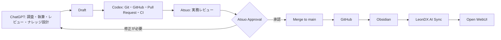

# LeonDX Salesforce Knowledge Base Project Charter

## 目次

- [1. Mission](#1-mission)
- [2. Goals](#2-goals)
- [3. Scope](#3-scope)
- [4. Quality Standards](#4-quality-standards)
- [5. Workflow](#5-workflow)
- [6. Approval Policy](#6-approval-policy)
- [7. Success Criteria](#7-success-criteria)
- [8. Principles](#8-principles)

## 1. Mission

本プロジェクトの使命は、8月下旬に開始予定のBASFプロジェクトに先立ち、
実務で活用できるSalesforce Knowledge Baseを構築することである。

- 実際のSalesforceコンサルティング業務を支える知識資産を作る。
- 厳選されたRAGナレッジにより、Open WebUIの回答品質を高める。
- LeonDXの知的財産として、再利用可能な知識を長期的に蓄積する。
- 単なる情報集ではなく、設計・判断・実装を支援する実践的な基盤を作る。

## 2. Goals

- プロジェクト開始前に、BASF Readyバックログを完了する。
- 書籍のような網羅性より、現場で役立つ実践的な知識を優先する。
- すべてのコンテンツをGitのバージョン管理下に置く。
- すべての章をOpen WebUIへ同期できる構造と品質にする。

## 3. Scope

### 対象範囲

本プロジェクトでは、次の領域を扱う。

- Architecture
- Data Model
- Security
- Sharing
- Permission Sets
- Flow
- Integration
- Sales Cloud
- Service Cloud
- Reporting
- Dashboards
- Agentforce
- Data Cloud（概要）
- Governance
- Best Practices

### 対象外

次の情報は、Knowledge Baseへ保存しない。

- 顧客の機密情報
- BASF固有の非公開情報
- 個人情報
- 社内プロジェクト文書

公開情報を基に作成する場合でも、対象外情報を推測、再構成、転記しない。

## 4. Quality Standards

すべての章は、次の構成要素を含まなければならない。

| 構成要素 | 目的 |
| --- | --- |
| Executive Summary | 主要な結論と実務上の価値を短く示す |
| Salesforce Official Guidance | Salesforce公式情報に基づく原則や仕様を示す |
| LeonDX Insight | LeonDX独自の実務的な知見を、公式見解と分けて示す |
| Architecture Decision | 採用する設計判断、理由、トレードオフを記録する |
| Best Practices | 推奨される設計・実装・運用方法を示す |
| Anti-patterns | 避けるべき方法、その理由、影響を示す |
| Checklist | 設計、レビュー、リリース時に確認できる項目を示す |
| FAQ | 現場で想定される質問に簡潔に回答する |
| RAG Keywords | 検索と検索拡張生成に有効なキーワードを整理する |
| References | 参照した公式資料や信頼できる情報源を記録する |

内容は正確性、実用性、検索性、保守性を備え、公式情報とLeonDX独自見解の
境界が明確でなければならない。

## 5. Workflow

### 役割分担

| 担当 | 主な責務 |
| --- | --- |
| ChatGPT | 調査、執筆、レビュー、ナレッジ設計 |
| Codex | Git、GitHub、Pull Request、CI、自動化 |
| Atsuo | 実務観点のレビュー、承認、マージ判断 |

### 全体フロー

マージ後の標準的な情報経路は、次のとおりとする。

**GitHub → Obsidian → LeonDX AI Sync → Open WebUI**

## 6. Approval Policy

明示的に承認されていない文書は、Open WebUIへ同期しない。

承認フローは次の順序を厳守する。

**Draft → Review → Atsuo Approval → Merge → AI Sync**

- Pull Requestの作成は承認を意味しない。
- CIの成功は品質確認の一部であり、Atsuoの承認を代替しない。
- Pull Requestの承認と`main`へのマージは、人間による最終判断とする。
- AI Syncは、承認済みコンテンツが`main`へマージされた後にのみ実行する。

## 7. Success Criteria

次の状態を満たしたとき、本プロジェクトは成功したと判断する。

- Open WebUIが、実践的なSalesforceの質問へ正確に回答できる。
- 作成したナレッジを、複数の案件や業務で再利用できる。
- GitHub上に変更履歴、レビュー履歴、承認履歴が維持される。
- 新しいナレッジを継続的かつ安全に追加できる。
- BASFプロジェクトの支援が、より迅速かつ高品質になる。

## 8. Principles

- **Practical over theoretical:** 理論だけでなく、実務で使える判断と手順を重視する。
- **Quality over quantity:** 文書量より、正確性、明確性、再利用性を優先する。
- **Official sources first:** Salesforce公式情報を第一の根拠とする。
- **LeonDX Insight clearly separated:** LeonDX独自の知見を公式見解と明確に分ける。
- **AI-first documentation:** AI検索、RAG、再利用を前提に文書を構造化する。
- **Continuous improvement:** 実務から得た知見とフィードバックを継続的に反映する。
